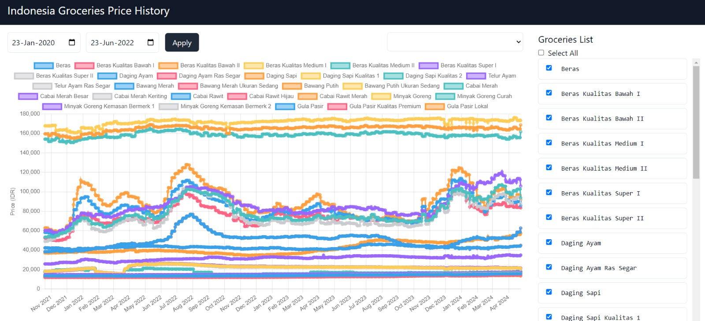

# Indonesian Grocery Price Tracker

This project is a group effort for an Information Management course, aimed at providing an interactive price chart of groceries in Indonesia. We leverage Python for backend data processing and cleaning, and Svelte for a dynamic and performant frontend experience.

## Features

- **Interactive Price Charts:** Visualize the price trends of various groceries in Indonesia over time.
- **Data-Driven Insights:** Gain valuable insights into the fluctuations of grocery prices.
- **User-Friendly Interface:** Easily navigate and explore the data with an intuitive interface.
- **Responsive Design:** Access the price charts seamlessly across different devices.

## Technologies Used

- **Backend:** Python with libraries listed in `requirements.txt`
- **Frontend:** Svelte
- **Styling:** Tailwind CSS
- **Package Management:** Bun

## Documentation



## Installation & Setup

1. **Clone the Repository:**
   ```bash
   git clone https://github.com/EvanescenT07/Indonesia-Groceries-Price-Chart.git
   ```
2. **Navigate to the Project Directory:**
   ```bash
   cd Indonesia-Groceries-Price-Chart
   ```
3. **Install Dependencies:**
   ```bash
   npm install -g bun
   ```
   ```bash
   pip install -r requirements.txt
   ```
4. **Run Backend**
   ```bash
   python app.py
   ```
5. **Navigate to Website Directory**
   ```bash
   cd website
   ```
6. **Install Package with Bun**
   ```bash
   bun i
   ```
7. **Run Frontend**
   ```bash
   bun run dev
   ```

## Contributing

We welcome contributions to improve this project. Please feel free to open issues for bug reports or feature requests. If you'd like to contribute code

## Team Members

- [Irfan Saf](https://github.com/irfansaf)
- [Joanatan Setiaji]()
- [Kevin Marchanda]()
- [Muhammad Ilham](https://github.com/Sytherrr)
- [Zulfikar Ahmad](https://github.com/EvanescenT07)

## License

This project is licensed under the MIT License. See the LICENSE file for details.
